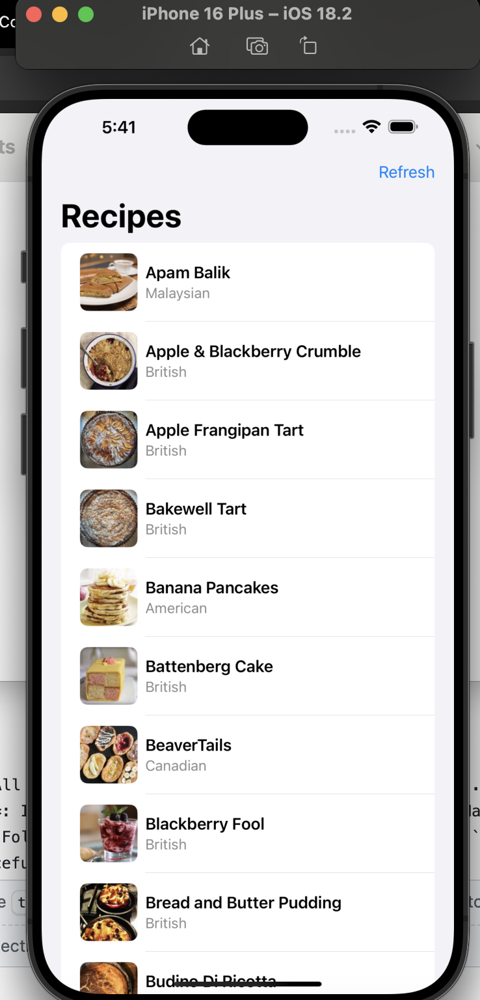
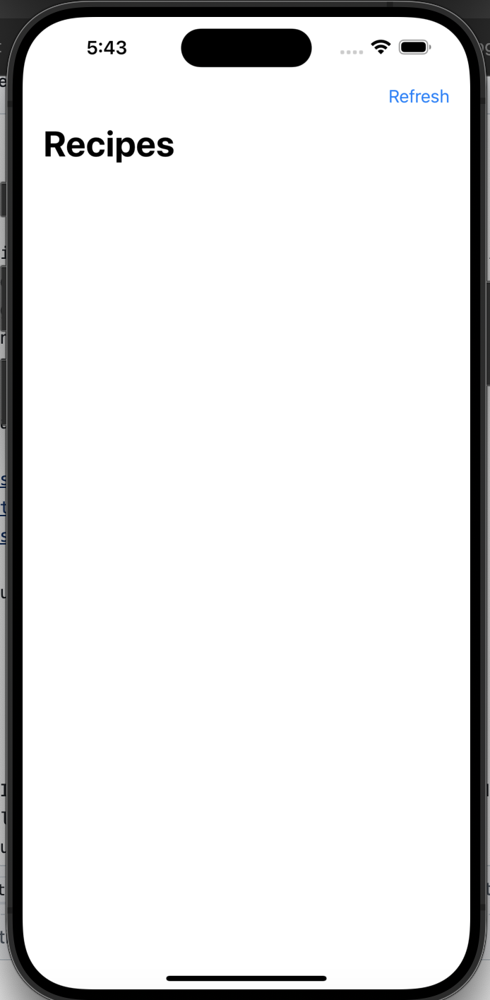

# 🍽️ Fetch Recipe App

## 📸 Summary

This is a SwiftUI app that displays a list of recipes fetched from a remote API. It supports:
- Lazy image loading only when rows are visible
- Manual disk caching of images (no `URLCache`, no 3rd-party)
- Full Swift Concurrency using `async/await`
- Error and empty state handling
- A refresh button to reload data
- MVVM architecture with clean folder structure

<h3>📸 Screenshots</h3>

  
  
  

---

## 🎯 Focus Areas

- **Swift Concurrency**: All networking and image loading uses `async/await`.
- **Manual image caching**: Implemented disk cache from scratch using `FileManager`.
- **Clean architecture**: Followed MVVM with separate folders for `Models`, `Services`, `Support`, `ViewModels`, and `Views`.
- **Error handling**: Gracefully handles empty and malformed responses.
- **Test coverage**: Added unit tests for `RecipeService` with live endpoint coverage.

I prioritized these areas because they represent production-ready expectations: testability, clarity, and efficiency.

---

## ⏱ Time Spent

**~6–7 hours total**, broken down as:
- 2 hrs: UI scaffolding (SwiftUI layout + row view)
- 2 hrs: Networking + decoding logic
- 2 hrs: Image caching logic + verification
- 1.5 hrs: Debugging edge cases, cleanup, README

---

## ⚖️ Trade-offs and Decisions

- **No LRU in-memory cache**: Kept caching simple with disk only (per requirement).
- **Static file-based hashing for cache keys**: Used `hashValue` of the URL to avoid image name collisions.
- **No detail view**: Focused on core list experience; could expand to detail view with `source_url` and `youtube_url`.

---

## 🧱 Weakest Part of the Project

- **No UI or integration tests**: Per the scope, only unit tests were included. Real-world apps would benefit from snapshot/UI testing.
- **Empty List**: When the recipe list is empty, the app shows a blank screen which confuses UX whether it is an error(blank) or loading.

---

## ℹ️ Additional Information

- iOS Target: iOS 16+
- Fully SwiftUI-based
- No external dependencies used — image loading and caching is entirely manual
- Tested endpoints:
  - ✅ `recipes.json` — Valid
  - ✅ `recipes-empty.json` — Shows empty list
  - ✅ `recipes-malformed.json` — Displays error message
